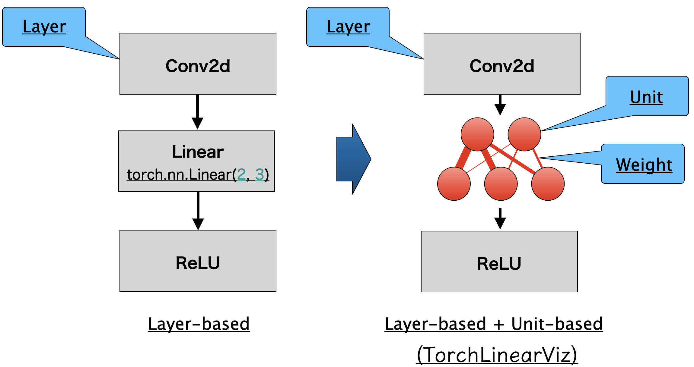
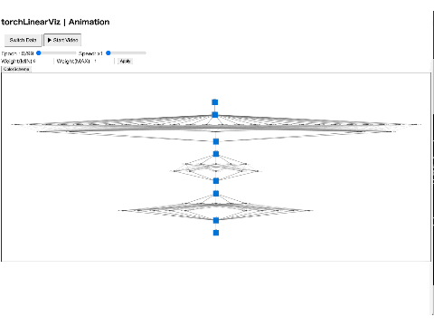

# torchLinearViz
Rleased torchLinearViz on https://pypi.org/project/torchLinearViz/

This is a tool to draw Neural Network architecture designed by PyTorch by Unit level especially in Linear layer. (other layers are drawn through layer-level like following figure.)




# How to install
```
pip install torchLinearViz
```

# Generated file
`epoch_visualizer.html` file is generated. In this file you can operate as the gif below.



- You can change view by "Switch Data" button (`Value` means value of weight, `Diff` means difference between last epoch)
- By "Start Video" button, you can see animation across epoch, this can zoom up or change position and position of node as you like.
- You can change Speed
- You can change Scale of each weight (if you set max as 1, min as 0 when `Diff` case, you will see nothing to change across epochs, but set "max" as 0.01, then you will see the change of weight clearly.)
- You can set Colorscheme (light or dark)

# demo Code
 Following code is from `./tests/demoMNIST.py` of this repo. Inserting "Initializer", "Update", "Save" lines, this library works, and `epoch_visualizer.html` will be generated.

```
# Import Library
from torchLinearViz import TorchLinearViz

# torchLinearViz Initialize
torchlinearviz = TorchLinearViz(model)

epochs = 100
for epoch in range(epochs):
    model.train()
    total_loss = 0

    for images, labels in train_loader:
        images, labels = images.to(device), labels.to(device)

        optimizer.zero_grad()
        outputs = model(images)
        loss = criterion(outputs, labels)
        loss.backward()
        optimizer.step()
        total_loss += loss.item()

    # update weight data
    torchlinearviz.update(model, images)
    print(f"Epoch [{epoch+1}/{epochs}], Loss: {total_loss/len(train_loader):.4f}")

# Save html file
torchlinearviz.end()
```
