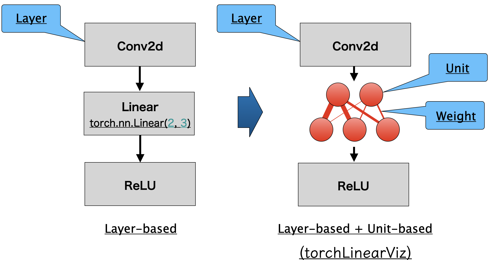

# torchLinearViz
Rleased torchLinearViz on https://pypi.org/project/torchLinearViz/

This is a tool to draw Neural Network architecture designed by PyTorch by Unit level especially in Linear layer. (other layers are drawn through layer-level like following figure.)




# How to install
```
pip install torchLinearViz
```

# Generated file
`epoch_visualizer.html` file is generated. In this file you can operate as the gif below.


- You can change view by "Switch Data" button (`Value` means value of weight, `Diff` means difference between last epoch)
- By "Start Video" button, you can see animation across epoch, this can zoom up or change position and position of node as you like.
- You can change Speed
- You can change Scale of each weight (if you set max as 1, min as 0 when `Diff` case, you will see nothing to change across epochs, but set "max" as 0.01, then you will see the change of weight clearly.)
- You can set Colorscheme (light or dark)

# demo Code
 Following code is from `./tests/demoMNIST.py` of this repo. Inserting "Initializer", "Update", "Save" lines, this library works, and `epoch_visualizer.html` will be generated.

```
import torch
import torch.nn as nn
import torch.optim as optim
import torchvision
import torchvision.transforms as transforms

# here import torchLinearViz
from torchLinearViz import TorchLinearViz

# 🔹 1. データの前処理
transform = transforms.Compose([transforms.ToTensor(), transforms.Normalize((0.5,), (0.5,))])

# 🔹 2. データセットの読み込み
train_dataset = torchvision.datasets.MNIST(root='./data', train=True, download=True, transform=transform)
test_dataset = torchvision.datasets.MNIST(root='./data', train=False, download=True, transform=transform)

train_loader = torch.utils.data.DataLoader(train_dataset, batch_size=64, shuffle=True)
test_loader = torch.utils.data.DataLoader(test_dataset, batch_size=64, shuffle=False)

# 🔹 3. MLP（全結合ニューラルネットワーク）モデルの定義
class MLP(nn.Module):
    def __init__(self):
        super(MLP, self).__init__()
        self.model = nn.Sequential(
            nn.Flatten(),  # 画像(28x28) → 1次元 (784)
            nn.Linear(28*28, 5),  # 入力 784 → 隠れ層 256 
#            nn.ReLU(),
            nn.Linear(5, 5),  # 隠れ層 256 → 128
#            nn.ReLU(),
            nn.Linear(5, 10)  # 出力 10クラス
        )

    def forward(self, x):
        return self.model(x)

# 🔹 4. モデルの作成
device = torch.device("cuda" if torch.cuda.is_available() else "cpu")
model = MLP().to(device)

# 🔹 5. 損失関数と最適化手法
criterion = nn.CrossEntropyLoss()
optimizer = optim.Adam(model.parameters(), lr=0.001)

# torchLinearViz initialize
torchlinearviz = TorchLinearViz(model)

# 🔹 6. 学習
epochs = 100
for epoch in range(epochs):
    model.train()
    total_loss = 0

    for images, labels in train_loader:
        images, labels = images.to(device), labels.to(device)

        optimizer.zero_grad()
        outputs = model(images)
        loss = criterion(outputs, labels)
        loss.backward()
        optimizer.step()
        total_loss += loss.item()

    # here updates weights of model
    torchlinearviz.update(model, images)

    print(f"Epoch [{epoch+1}/{epochs}], Loss: {total_loss/len(train_loader):.4f}")

# here generates html file
torchlinearviz.end()
```
